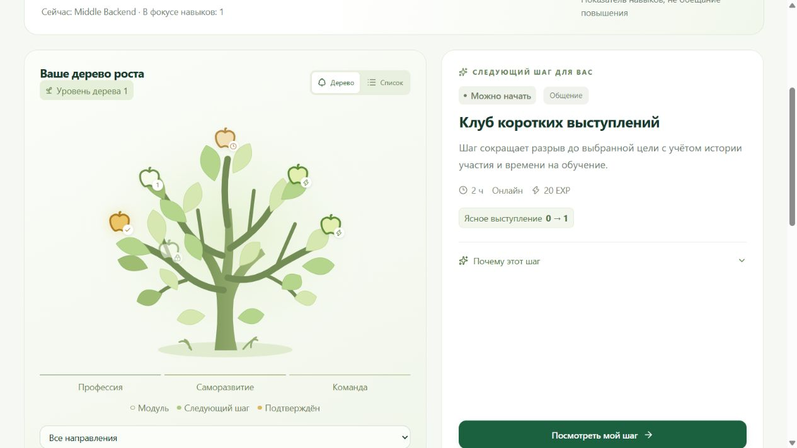
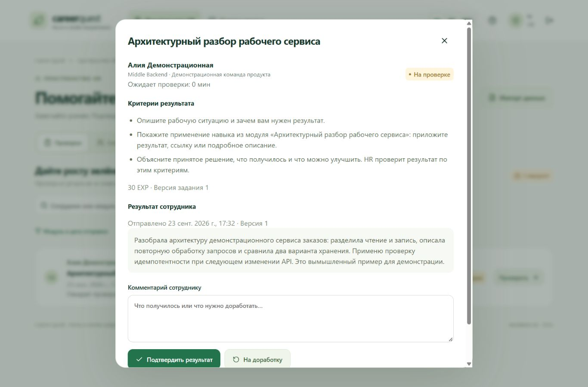
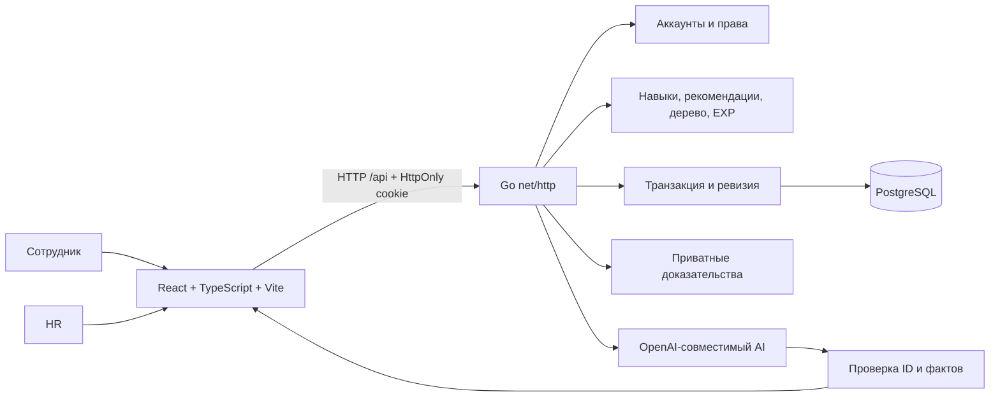

# Career Quest

Персональный AI-помощник для развития сотрудника: выбрать цель, найти полезный следующий шаг, применить навык в работе и получить подтверждение результата от HR.

**Цель → дерево развития → модуль → практический результат → проверка HR → навыки и EXP.**

Сотрудник видит, зачем ему конкретный модуль, с чего начать и как результат пригодится в работе. HR открывает профили, проверяет доказательства и видит, где команде нужна поддержка. Интерфейс доступен на русском, казахском и английском; названия исходного каталога сохраняются.

## Возможности

- Персональные профили и учётные записи для сотрудников, отдельный доступ HR.
- Карьерная цель, реальные навыки, объяснение разрывов и 1–3 рекомендации.
- Дерево развития: ветки — направления, яблоки — модули. Доступен обычный список.
- Практические задания, отправка текста, ссылки или файла, очередь проверки HR.
- Подтверждение или возврат с комментарием; версии результата и решения сохраняются.
- Monthly EXP, общий опыт, энергия дерева и рейтинг «Лидер месяца по EXP».
- AI-помощь: объяснить пользу, предложить первый шаг, упростить задачу или найти альтернативу. При недоступности модели работает явный резервный режим.
- HR-аналитика дефицитов навыков, участия и сотрудников без следующего шага; импорт JSON/CSV.

**Игровой уровень дерева, реальные навыки и должностной грейд — разные показатели.** Рост дерева не означает повышения. EXP показывает подтверждённые активности, а не полную оценку качества работы человека.

## Интерфейс

Скриншоты сделаны в работающем приложении на отдельном авторском наборе: все имена, модули и доказательства на них вымышлены. Закрытые данные организаторов не использовались.





## Быстрый запуск: Docker

Нужны Git, Node.js 24, Go не ниже 1.25, Docker Desktop с Linux Engine и стартовый набор организаторов. Данные не публикуются в репозитории.

Для **новой установки с пустой БД**, PowerShell:

```powershell
git clone https://github.com/BAITC-Hacks/hack-4a947dc4-radivaiba.git
cd hack-4a947dc4-radivaiba
npm run setup -- --data-dir "C:\папка\стартового-набора"
docker compose up -d --wait postgres
$env:BUILD_VERSION = git rev-parse --short HEAD
docker compose build careerquest
docker compose run --rm --no-deps careerquest /app/provision-accounts --output /app/data/credentials/accounts.json
docker compose up -d careerquest
docker compose cp careerquest:/app/data/credentials/accounts.json ./data/credentials/accounts.json
npm run credentials
```

Откройте **http://localhost:8080**. Команда `credentials` показывает первоначальные логины и пароли `E0001` и `hr`. Другой сотрудник: `npm run credentials -- --login E0002`.

В Bash задайте версию через `export BUILD_VERSION=$(git rev-parse --short HEAD)` и используйте свой путь к данным. Остальные команды совпадают.

Если вы уже пользовались JSON-версией, сначала выполните [перенос сохранённого прогресса](docs/OPERATIONS.md#перенести-старый-json-прогресс-в-postgresql). Запуск нового сервера с seed сам по себе не переносит старый runtime.

`setup` принимает `skills.json`, `employees.json`, `events.json`, `activity_history.csv` и варианты с `(1)`. Он проверяет набор, готовит `.env`, сохраняет существующие настройки и устанавливает зависимости по lock-файлу. Provision создаёт только отсутствующие аккаунты и не сбрасывает пароли. Первоначальные пароли находятся в приватном экспорте; храните его вне Git.

## Локальная разработка

PostgreSQL остаётся в Docker, Go и Vite запускаются локально. На одной БД должен работать **один экземпляр приложения**.

```powershell
docker compose stop careerquest
docker compose up -d --wait postgres
npm run accounts:provision
npm run credentials
npm run dev
```

Интерфейс: **http://localhost:5173**; Vite проксирует `/api` к Go на 8080. `npm run demo` собирает frontend и отдаёт интерфейс вместе с API через Go на 8080. Остановка — `Ctrl+C`.

Если аккаунты уже созданы в Docker, скопируйте их приватный экспорт. Повторный provision не восстанавливает существующие пароли из хешей. Для добавленного через HR профиля остановите приложение, выполните `npm run accounts:provision -- --employee <ID> --output data/credentials/new-accounts.json`, затем перезапустите приложение, чтобы обновить снимок. Пароль: `npm run credentials -- --file data/credentials/new-accounts.json --login <ID>`.

## Конфигурация

| Переменная                     | Назначение                               | По умолчанию                            |
| ------------------------------ | ---------------------------------------- | --------------------------------------- |
| `DATABASE_URL`                 | Обязательное подключение Go к PostgreSQL | Генерируется setup, локальный порт 5433 |
| `POSTGRES_DB`, `POSTGRES_USER` | БД и пользователь контейнера             | `careerquest`                           |
| `POSTGRES_PASSWORD`            | Пароль PostgreSQL                        | Генерируется локально                   |
| `POSTGRES_PORT`                | Порт БД на компьютере                    | `5433`                                  |
| `HOST`, `PORT`                 | Адрес Go                                 | `127.0.0.1`, `8080`                     |
| `EVIDENCE_DIR`                 | Приватные доказательства                 | `data/evidence`                         |
| `ORG_TIMEZONE`                 | Часовой пояс                             | `Asia/Qyzylorda`                        |
| `APP_MODE`                     | `demo` — фиксированная дата; `live` — календарь организации | `demo`                    |
| `DEMO_DATE`                    | Бизнес-дата демо                         | Пусто: `meta.as_of_date` набора         |
| `DATA_DIR`                     | Каталог seed при первом заполнении БД    | `data/seed`                            |
| `WEB_DIR`                      | Production-сборка frontend               | `frontend/dist`                        |
| `DEV_ORIGIN`                   | Разрешённый origin Vite при разработке   | Задаётся `npm run dev`                  |
| `BUILD_VERSION`                | Версия Docker-сборки                     | Короткий SHA коммита                    |
| `LLM_BASE_URL`                 | Префикс Chat Completions API             | `https://api.openai.com/v1`             |
| `LLM_MODEL`                    | Модель провайдера                        | Пусто: резервный режим                  |
| `LLM_API_KEY`                  | Серверный ключ                           | Пусто: резервный режим                  |
| `LLM_TIMEOUT_MS`               | Таймаут AI                               | `8000`                                  |

Не включайте `/chat/completions` в `LLM_BASE_URL`: адаптер добавляет маршрут. Ключ не передаётся браузеру. После изменения окружения перезапустите приложение. Изменение `.env` не меняет пароль пользователя уже созданной PostgreSQL.

## Проверка результата и EXP

Сотрудник отправляет доказательство; до HR-подтверждения навыки, энергия и EXP не начисляются. Возвращённое задание можно исправить и отправить новой версией. HR не подтверждает собственную работу. Повторный или одновременный запрос не создаёт вторую награду. Ошибочное подтверждение отменяется отдельным решением с сохранением истории.

Награда добровольного модуля: **20 EXP** до 4 часов, **40 EXP** свыше 4 до 12 часов, **60 EXP** свыше 12 часов. Надбавка за prerequisites: 10 EXP при начальном требовании либо 20 EXP при требуемом уровне 3 и выше; надбавки не складываются. Размер фиксируется при начале модуля и виден заранее. Обязательные события не дают EXP и не входят в добровольное дерево.

`EV_036` можно завершать один раз за бизнес-день; EXP начисляется не более раза в месяц. Исторические завершения сохраняют влияние на навыки, но не получают новый EXP задним числом. AI не выбирает сумму награды.

Monthly EXP относится к месяцу подтверждения по бизнес-дате; реальное время решения хранится для аудита. Дата набора `2026-10-01` означает демонстрационный октябрь 2026. Общий EXP и дерево не сбрасываются ежемесячно. Уровень дерева: `1 + floor(total_exp / 100)`, энергия до следующего уровня: остаток от деления на 100.

В режиме `APP_MODE=demo` календарь фиксирован; для следующего месяца задайте `DEMO_DATE=2026-11-01` и перезапустите приложение. В `APP_MODE=live` дата и месяц меняются автоматически по `ORG_TIMEZONE`, без перезапуска. Нельзя включать live-режим раньше даты набора: сентябрьские часы компьютера не подходят для октябрьского демонстрационного каталога.

При равном EXP сотрудники разделяют место. Авторизованным сотрудникам в рейтинге доступны только имя, место и EXP. Чужие профили и доказательства остаются закрыты; HR видит служебные сведения и фильтры. При нулевом результате победитель не назначается.

## Архитектура



Стек: React/TypeScript/Vite, Go `net/http`, PostgreSQL 18, драйвер pgx v5. SQL-миграции встроены в бинарный файл. Запись сначала фиксируется в БД, затем публикуется в неизменяемом снимке Go. В БД находятся каталог, профили, история, аккаунты, заявки, решения и журнал EXP. Доказательства хранятся приватно; скачивание проверяет права.

```text
frontend/src/             экраны, дерево, API, переводы и стили
backend/cmd/             сервер, перенос JSON, подготовка аккаунтов
backend/internal/model/  данные и API
backend/internal/store/  PostgreSQL, миграции, импорт и workflow
backend/internal/engine/ расчёты навыков, рекомендаций и EXP
backend/internal/llm/    AI и резервные объяснения
backend/internal/auth/   пароли и серверные сессии
backend/internal/httpapi/ маршруты и права
contracts/               OpenAPI
scripts/                 подготовка, запуск и проверки
docs/                    архитектура, эксплуатация, команда и защита
```

Подробные правила: [ARCHITECTURE.md](docs/ARCHITECTURE.md). Контракт запросов: [OpenAPI](contracts/openapi.yaml).

## Импорт, сохранение и обновление

HR загружает employees JSON и/или history CSV. Сотрудники объединяются по `employee_id`, история — по `record_id`. Весь пакет проверяется до записи: ошибка не применяет часть данных, повторная загрузка не создаёт дубли. Аккаунт для нового профиля готовится отдельно. Служебные решения и EXP не редактируются импортом организаторской истории.

После первого заполнения PostgreSQL становится источником истины. Изменение seed не перезаписывает БД. Данные сохраняются после перезапуска. [OPERATIONS.md](docs/OPERATIONS.md) содержит команды переноса JSON, резервного копирования, восстановления и обновления без удаления volumes, а также диагностику старого frontend, портов, БД, миграций и AI.

## Проверки

```powershell
npm run check
go -C backend vet ./...
npm run test:postgres
```

`check` запускает Go-тесты, TypeScript и production-сборку. `test:postgres` создаёт отдельные случайные тестовые БД и удаляет только их; нужен PostgreSQL и право `CREATEDB`. Обычный `go test` без `TEST_DATABASE_URL` пропускает DB-тесты. Race detector выполняется в поддерживающей среде Linux. Подтверждённые результаты, версии инструментов и ограничения: [VERIFICATION.md](docs/VERIFICATION.md).

## Команда и защита

| Разработчик | Область                                                 | Ветка             |
| ----------- | ------------------------------------------------------- | ----------------- |
| №1          | React, дерево, формы, переводы, доступность             | `codex/frontend`  |
| №2          | PostgreSQL, API, права, файлы, интеграция, документация | `codex/backend`   |
| №3          | Навыки, EXP, рекомендации, AI, тесты алгоритма          | `codex/ai-engine` |

Работайте в отдельных клонах. Интегратор объединяет проверенные изменения в `codex/mvp`, запускает проверки, затем готовит PR в `main`. Контракт согласуется до параллельной реализации. Подробнее: [AGENTS.md](AGENTS.md), [TEAM_PLAN.md](docs/TEAM_PLAN.md).

За 5–7 минут покажите личную цель, дерево, пользу следующего шага, отправку доказательства, HR-подтверждение, обновление EXP и HR-аналитику. Порядок демонстрации: [DEMO.md](docs/DEMO.md).

## Ограничения и следующие шаги

Локальный MVP рассчитан на один сервер. Нет SSO, реального бронирования мероприятий, магазина наград, автоматического повышения или принятия решений AI вместо HR. Практические критерии задаёт приложение поверх каталога; это не дополнительные требования организаторов. Редактор заданий, уведомления, расширенный диалог и несколько серверов — последующие этапы.

Никогда не публикуйте `.env`, датасет, runtime, дампы БД, первоначальные пароли или доказательства сотрудников. Внешнюю AI-модель и восстановление резервной копии отмечайте проверенными только после реального выполнения соответствующего сценария.
