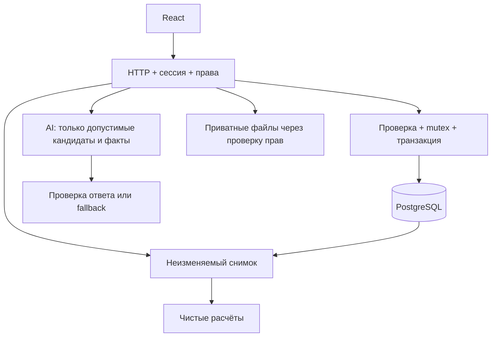

# Архитектура Career Quest

## Данные и границы

Один Go-сервис отдаёт React и API. PostgreSQL 18 — основное хранилище; pgx v5 используется через database/sql. Снимок в памяти неизменяем. Все прикладные записи сериализуются mutex, сохраняются одной SQL-транзакцией с проверкой ревизии и публикуются в памяти только после COMMIT. Поддерживается один экземпляр сервера; устаревший второй процесс получает конфликт, а не перезаписывает данные.

Исходные таблицы: skills, role_profiles, employees, events, activity_history, dataset_metadata. Карты навыков и списки — JSONB; ID и ссылки защищены ключами. Organizer-форматы не расширяются служебными полями аккаунтов/заявок. Прикладные таблицы: accounts, employee_preferences, module_config, enrollments, submission_versions, attachments, review_decisions, exp_ledger. Служебные связи и ограничения находятся в SQL, полные представления сущностей сохраняются в JSONB.

Миграции встроены через go:embed и применяются под advisory transaction lock. В новой пустой БД seed загружается целиком одной транзакцией. Для перехода с JSON используется отдельная команда migrate-legacy: проверка полного runtime, импорт только в пустую БД, сравнение всех исходных полей и checksum-маркер. Оригинал не меняется. Обычный старт не мигрирует старый JSON автоматически.

## Навыки, цель и рекомендации

Навыки профиля уже отражают последнюю оценку. Добавляются completed после last_review_date до бизнес-даты включительно, в порядке (date, record_id). Новая прикладная запись в день оценки считается отдельным действием; CSV не может установить demo-флаг. Отменённые подтверждения исключаются из расчётного представления истории, но остаются в журнале.

Рост навыка: `max(old, min(5, max_level, old + gain))`. Уровень никогда не уменьшается из-за низкого max_level. Цель — выбранная пользователем допустимая пара роли/грейда; иначе цель профиля или следующий грейд. Lead без цели развивается относительно требований текущего уровня. Прогресс — взвешенная доля покрытия требуемых уровней, вес критических навыков 3, прочих 1. Автоматического повышения нет.

Рекомендации исключают обязательные события, невыполненные prerequisites, неподходящую аудиторию, отсутствие будущей сессии (кроме self_paced), завершённые неповторяемые события и шаги без полезного прироста для цели. Подготовка к целевой роли обозначается явно. Приоритет:

`взвешенное сокращение разрыва × (завершения + 1) / (завершения + пропуски + отказы + бросания + 2) / sqrt(max(часы, 1))`.

Для начатой активности — множитель 1.25; при равенстве — event_id. Участие сравнивается по добровольным событиям того же типа и формата. Отсутствие кандидатов возвращает объяснение, а не ошибку.

LLM получает ограниченный набор кандидатов и проверяемые факты goal/gap/history. Ответ проверяется по допустимым ID, дублям и ссылкам на факты; числа навыков и EXP вычисляет Go. Таймаут 8 секунд без повторов; при ошибке возвращается базовый рейтинг с явным режимом rules. Свободный текст не является независимым доказательством прогресса.

AI-помощник даёт пользу, первый шаг и пример применения. Подготовительное упражнение не начисляет EXP и не заменяет HR-решение. Текст UI и шаблоны помощи локализованы ru/kk/en. Чувствительные вложения не нужны модели для мотивационного объяснения.

## Модули, проверка и доказательства

Один существующий event — один модуль и один оцениваемый результат. Практические критерии приложения версионируются отдельно от каталога. При начале замораживаются критерии и награда; смена цели не удаляет начатый модуль и не отменяет отправленную работу.

Состояния: available, locked, in_progress, pending, changes_requested, completed. Recommended — отдельный вычисляемый признак. Сотрудник отправляет новую неизменяемую версию результата. HR подтверждает либо возвращает с обязательным комментарием. Он не может подтвердить задание собственного employee_id.

Решение, completion, EXP и revision фиксируются одной транзакцией. Уникальные ключи источника награды и запроса, проверка версии и текущего состояния защищают от двойного начисления и конкурирующих решений. Старый endpoint самостоятельного завершения отключён. Отмена добавляет отдельное решение и отрицательную запись EXP; исходная история не удаляется.

Файлы находятся вне web-root, имена хранения генерируются сервером. Доступ к скачиванию проверяется по владельцу/HR; публичных URL нет. Разрешены ограниченные форматы и объёмы, проверяется содержимое, выдача как attachment с nosniff. Внешние ссылки не скачиваются сервером автоматически.

## Monthly EXP и дерево

Награда фиксируется до начала: 20 EXP до 4 часов, 40 до 12, 60 свыше 12; prerequisites дают одну надбавку 10 либо 20 (если требуется уровень ≥3). Обязательные активности — 0. EV_036 повторяется раз в бизнес-день, награда — максимум раз за месяц. Историческая импортированная активность не получает EXP задним числом.

Monthly EXP — сумма журнала за месяц подтверждения по бизнес-дате организации. Реальное UTC-время сохраняется для аудита. По умолчанию демо использует meta.as_of_date=2026-10-01, зона Asia/Qyzylorda; это явно показано в интерфейсе. Отмена корректирует исходный месяц. При равных значениях одинаковое место, нулевой результат не назначает лидера.

Общий EXP не сбрасывается. `tree_level = 1 + floor(total_exp / 100)`, `energy = total_exp % 100`. Ветки группируют реальные модули по направлениям, состояния яблок приходят с сервера. До HR-подтверждения яблоко показывает ожидание и не добавляет энергию. SVG/CSS анимация — представление, а не источник бизнес-состояния; reduced-motion отключает движение.

Публичный внутри авторизованного приложения рейтинг раскрывает только имя, место и EXP. Чужие профили, отделы и материалы сотруднику не раскрываются. HR-аналитика и фильтры доступны HR.

## Аккаунты, импорт и эксплуатация

Учётная запись отделена от профиля, содержит хеш пароля и привязку employee_id. HR-роль определяется сервером. Cookie — HttpOnly/SameSite Strict; токен сессии хранится в памяти, перезапуск требует повторного входа. Новый импорт профиля сам по себе не выдаёт доступ: нужен provision accounts.

Импорт объединяет по ID, сначала валидирует весь пакет, затем сохраняет. Даты, ссылки, статусы и диапазоны проверяются. Служебные записи приложений защищены от CSV-перезаписи. Настройки цели пользователя находятся отдельно от baseline-профиля.

Инструкция запуска и резервного копирования: OPERATIONS.md. Не выполняйте внешние SQL-правки параллельно работающему процессу. `/api/health` проверяет доступность БД; версия сборки помогает выявить старый Docker image.
