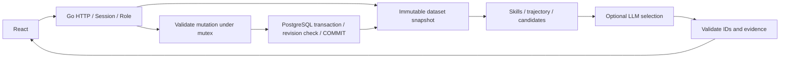

# Архитектура



Один Go-сервис и PostgreSQL, драйвер pgx v5. В production Go отдаёт React и API, в dev Vite проксирует `/api`. Системное время используется только для сессий и таймаутов; бизнес-дата — дата набора.

## Навыки

Профиль уже отражает последнюю оценку. Добавляются `completed` после `last_review_date` до `as_of_date` включительно, по `(date, record_id)`. Новая демо-запись в день оценки учитывается как действие после оценки; CSV-импорт не может установить флаг `demo`.

```text
new = max(old, min(5, max_level, old+gain))
goal = career_goal, иначе следующий грейд своей роли
Lead без цели → текущие требования Lead
weight = 3 для critical_skills, иначе 1
progress = 100 × sum(weight × min(current, required)) / sum(weight × required)
```

Шкала 0–5, прогресс округляется до 0.1%. Критические разрывы показаны отдельно. Нет автоматического повышения; исходные skills не перезаписываются расчётными.

## Рекомендации

Фильтры: добровольность; текущая или целевая пара роль/грейд; prerequisites; будущая сессия или self_paced; отсутствие завершения (исключение EV_036); положительное сокращение разрыва цели.

При смене роли аудитория может соответствовать целевой паре, но prerequisites проверяются по реальным навыкам. Это допущение MVP отмечается в карточке.

```text
benefit = sum(weight × min(actual_gain, max(0, required-current)))
history_fit = (completed_similar+1) /
              (completed_similar+no_show_similar+dropped_similar+declined_similar+2)
score = benefit × history_fit / sqrt(max(duration_hours,1))
in_progress → score × 1.25
```

Похожие события — добровольные того же типа и формата, история до даты среза. Пустая история даёт коэффициент 0.5. При равенстве сортировка по event_id. HR определяет отсутствие шага без LLM.

LLM выбирает 1–3 из восьми лучших кандидатов и возвращает event_id, explanation, evidence_ids. Обязательны goal, gap, history данного кандидата. Неизвестные ID, дубли, неполный JSON/факторы, ошибка HTTP и таймаут переключают весь ответ в rules. Подтверждённые числа и прирост вычисляет Go. Полной семантической проверки свободного текста LLM нет; проверяемые факты показываются отдельно.

LLM-таймаут до 8 секунд без повторов. Имена и весь датасет не отправляются. Кэш отсутствует: после импорта и завершения расчёты свежие.

## Состояние

Snapshot неизменяем. Записи выполняются под mutex с копированием изменяемых срезов. PostgreSQL — основное хранилище: ревизия, профили и история сохраняются одной транзакцией, после COMMIT новый снимок публикуется в памяти. Upsert не создаёт дубликатов ID; неизменившиеся строки не обновляются. Проверка ревизии запрещает перезаписывать данные устаревшим снимком другого процесса. Чтения используют снимок в памяти, поэтому поддерживается один экземпляр сервера; после внешних изменений БД сервер нужно перезапустить.

При запуске встроенные SQL-миграции применяются под транзакционной advisory-блокировкой, версии записываются в `careerquest.schema_migrations`. Если `dataset_metadata` пуста, четыре seed-файла валидируются и импортируются одной транзакцией. Ошибка не оставляет частично загруженный набор. Повторный запуск использует существующую БД и не требует seed. `/api/health` проверяет соединение с БД и возвращает 503 при недоступности. На запуск отведено 30 секунд, на запись — 10 секунд, на health-проверку — 2 секунды.

Основные сущности находятся в таблицах `skills`, `role_profiles`, `employees`, `events`, `activity_history` в схеме `careerquest`. Внешние ключи связывают историю с сотрудниками и событиями, сотрудников — с руководителями и профилями ролей. Вложенные карты навыков и списки каталога хранятся как JSONB и проверяются валидатором Go. `position` сохраняет порядок исходных списков при перезапуске. JSON-файловое хранилище используется только вспомогательными тестами; автоматического перехода на него при ошибке БД нет.

Завершение идемпотентно по сотрудник/событие, для клуба — сотрудник/событие/дата. Начатая активность переводится в completed, иначе создаётся DEMO_-запись. CSV-импорт не может использовать этот префикс. Дата среза не сдвигается.

Импорт объединяет по employee_id/record_id. Полный пакет проверяется до сохранения: ссылки, даты, диапазоны, статусы, дубли внутри файла. Ошибка не применяет часть пакета. Новая дата оценки импортированного профиля естественно меняет окно пересчёта.

## HR и доступ

Дефицит — сотрудники с gap > 0 относительно цели; required_by — только те, кому навык нужен. Участие — строки истории, повторяемый клуб даёт несколько участий одного сотрудника.

Cookie: случайные 32 байта, HttpOnly, SameSite=Strict, 8 часов. Роль хранится на сервере; сотрудник видит себя, HR — остальных и импорт. Изменяющие запросы проверяют Origin. Для локального HTTP cookie без Secure. Для внешнего запуска нужны HTTPS, Secure-cookie, полноценный вход и аудит.

Источник контракта — contracts/openapi.yaml, Go DTO — model/model.go, TS — frontend/src/api/types.ts. Ошибка: `{error:{code,message}}`. Владелец контракта №2 согласует изменения с №1.
